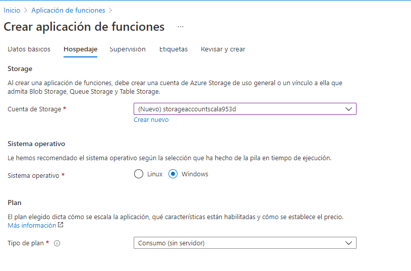

# ARSW - Laboratorio 10

## Laboratorio – Escalamiento en Azure con Maquinas Virtuales, Sacale Sets y Service Plans

## Integrantes:

- Crhystian Molano
- Juan Caceres

### Descripción
Adjunto a este laboratorio usted podrá encontrar una aplicación totalmente desarrollada que tiene como objetivo calcular el enésimo valor de la secuencia de Fibonnaci.

Escalabilidad Cuando un conjunto de usuarios consulta un enésimo número (superior a 1000000) de la secuencia de Fibonacci de forma concurrente y el sistema se encuentra bajo condiciones normales de operación, todas las peticiones deben ser respondidas y el consumo de CPU del sistema no puede superar el 70%.

### *PARTE I: Escalabilidad Serverless (Functions)*

Se crea la aplicación de funciones con los datos necesarios.

Se configura los datos basicos.

se configura el Hospedaje.

Se realiza la instalacion de Azure Functions.

se realiza un deploy de la aplicacion.

Deployment exitoso.

se realiza pruebas desde azure.

se realiza las pruebas con postman.

**Preguntas**

1. ¿Qué es un Azure Function?

Azure Function:
Es un servicio informático sin servidor que permite al usuario ejecutar código desencadenado por eventos sin tener que aprovisionar o administrar la infraestructura. Al ser un servicio basado en disparadores, ejecuta un script o un fragmento de código en respuesta a una variedad de eventos.

2. ¿Qué es serverless?

La informática sin servidor permite a los desarrolladores crear aplicaciones más rápidamente al eliminar la necesidad de administrar la infraestructura. Con las aplicaciones sin servidor , el proveedor de servicios en la nube aprovisiona, escala y administra automáticamente la infraestructura necesaria para ejecutar el código.

3. ¿Qué es el runtime y que implica seleccionarlo al momento de crear el Function App?

proporciona una forma de experimentar Azure Functions antes de comprometerse con la nube. El tiempo de ejecución abre nuevas opciones, como el uso de la potencia de cálculo de repuesto de las computadoras locales para ejecutar procesos por lotes durante la noche. La selección del runtime permite que los activos de código que se crean se puedan llevar a la nube cuando se realice la migración.

4. ¿Por qué es necesario crear un Storage Account de la mano de un Function App?

Azure Functions se basa en Azure Storage para operaciones como la administración de desencadenadores y el registro de ejecuciones de funciones.

5. ¿Cuáles son los tipos de planes para un Function App?, ¿En qué se diferencias?, mencione ventajas y desventajas de cada uno de ellos.

    - Plan de consumo.
      Este plan permite que las instancias del host se agregan y quitan dinámicamente según la cantidad de eventos entrantes. ofrece los siguientes beneficios:
        1. Se paga solo cuando las funciones se estén ejecutando.
        2. Se escala automáticamente, incluso durante períodos de alta carga.

    - Plan premium.
      Este plan permite que las instancias del host se agreguen y eliminen en función del número de eventos entrantes, al igual que el plan de consumo. tiene los siguientes beneficios:
        1. Instancias perpetuamente calientes.
        2. Duración de ejecución ilimitada.
        3. Conectividad de red virtual.
        4. Asignación de aplicaciones de alta densidad.

    - Plan dedicado.
      Permite que las aplicaciones de función también puedan ejecutarse en las mismas máquinas virtuales dedicadas. tiene los siguientes beneficios:
        1. Permite escalar horizontalmente.
        2. Escalamiento automático.

6.¿Por qué la memoization falla o no funciona de forma correcta?

Ocurren problemas en la recursión con números muy grandes. sucede un desbordamiento de la pila que causa que se agote el espacio de memoria de la misma.

7.¿Cómo funciona el sistema de facturación de las Function App?

El plan de consumo de Azure Functions se factura en función del consumo de recursos y las ejecuciones por segundo.
